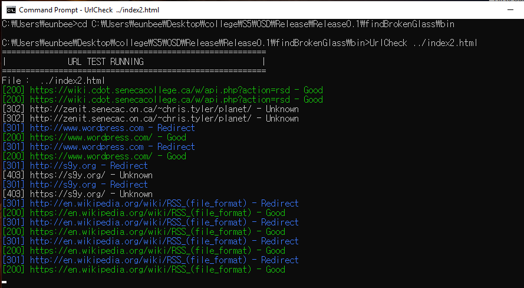
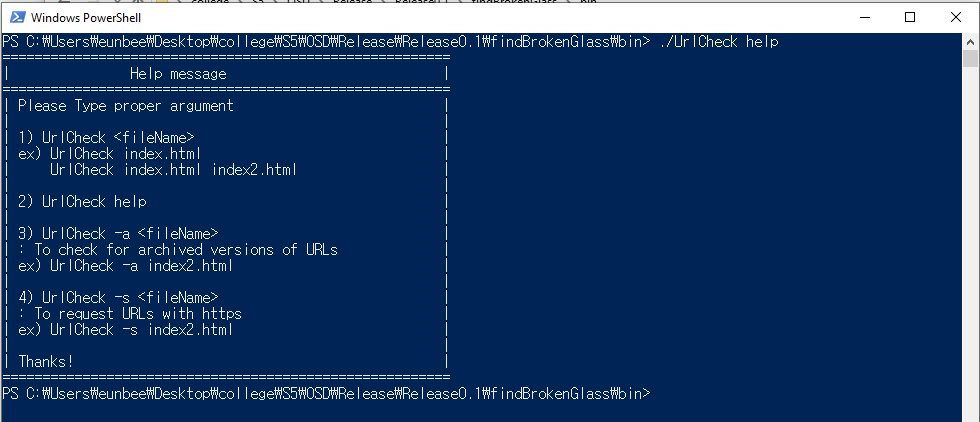

# findBrokenGlass

## About
This repo is a open source tool to check a connection status of URLs found from the input file, using Java. It returns "[code] url status" in each line.

### Features
 - Looking for the URLs in the input file
 - Accepting over two input files
 - Returning 200 code with Good status, 400 and 404 codes with Bad status
 - Colouring the output by the status : Good - Green, Bad - Red, Redirect - Blue, Fail - Red, UnKnown - Gray
 - Redirecting to followed location when it is 301, 307 and 308
 - Checking a version of archived URLs using the WayBackMachine
 - Checking whether Urls work with https or not

## Getting Started
 
  1. Clone the repo
  
  ```bash
  git clone https://github.com/eunbeek/findBrokenGlass.git
  ```
  
  2. Run the UrlCheck.exe file in bin folder on CMD/PowerShell/Terminal

 
## Usage
Please see the appropriate guide for your CLI of choice:

 ### CMD
   <p align="Left">
     
   </p>
   
  This command returns a help message for the flag and the argument explanation.
  ```bash
  UrlCheck help
  ```
  
  You can type the input file name after tool name, then return the response code, URL and status in each line.
  This tool accepts multiple files and delimiters by space.
  ```bash
  UrlCheck <fileName>
  ```

  ```bash
  UrlCheck <fileName1> <fileName2>
  ```
  
  You can type '-a' flag to allow checking for archived versions of URLs.
  ```bash
  UrlCheck -a <fileName>
  ```
   
  This '-s' flag change 'http' to 'https' in URLs and you can check whether url work with https or not. 
  ```bash
  UrlCheck -s <fileName>
  ```

 ### PowerShell
  <p align="">
 
 </p>

  This command returns a help message for the flag and the argument explanation.
  ```bash
  ./UrlCheck 
  ```
  
## Library 
https://github.com/java-native-access/jna
  
  


